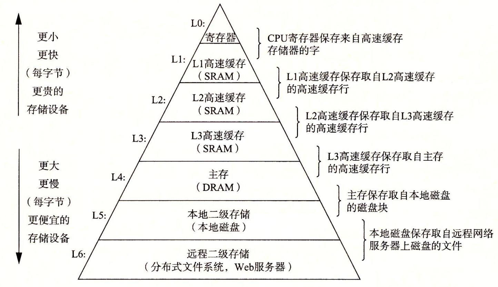

# 1.6 存储设备形成层次结构

在处理器和一个较大较慢的设备（例如主存）之间插**入**一个更小更快的存储设备（例如高速缓存）的想法已经成为一个普遍的观念。实际上，每个计算机系统中的存储设备都被组织成了一个**存储器层次结构**，如图 1-9 所示。在这个层次结构中，从上至下，设备的访问速度越来越慢、容量越来越大，并且每字节的造价也越来越便宜。寄存器文件在层次结构中位于最顶部，也就是第 0 级或记为 L0。这里我们展示的是三层高速缓存 L1 到 L3，占据存储器层次结构的第 1 层到第 3 层。主存在第 4 层，以此类推。

存储器层次结构的主要思想是上一层的存储器作为低一层存储器的高速缓存。因此，寄存器文件就是 L1 的高速缓存，L1 是 L2 的高速缓存，L2 是 L3 的高速缓存，L3 是主存的高速缓存，而主存又是磁盘的高速缓存。在某些具有分布式文件系统的网络系统中，本地磁盘就是存储在其他系统中磁盘上的数据的高速缓存。 正如可以运用不同的高速缓存的知识来提高程序性能一样，程序员同样可以利用对整个存储器层次结构的理解来提高程序性能。第 6 章将更详细地讨论这个问题。
