# 2.2 整数表示
&emsp;&emsp;在本节 ，我们描述用位来编码整数的两种不同的方式 ：一 种只能表示非负数，而另
一种能够表示负数 零和正数。后面我们将会看到它们在数学属性和机器级实现方面密切
相关。我们还会研究扩展或者收缩 编码整数以适应不同长度表示的效果。
> 图 2-8 列出了我们引 的数学术语，用于精确定义和描述计算机如何编码和操作整
这些术语将在描述的过程中介绍，图在此处列出作为参考。
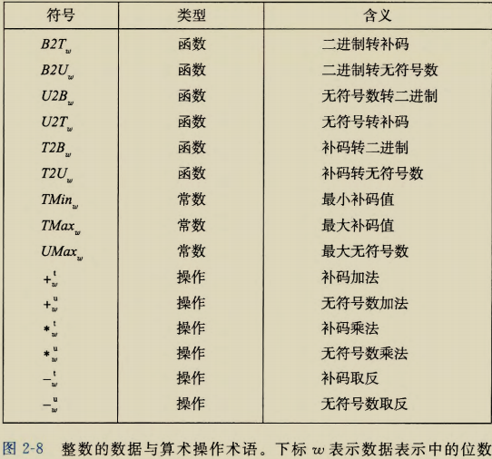{ width="800"}

## 2.2.1 整型数据类型 

&emsp;&emsp;C语言支持多种整型数据类型 表示有限范围的整数。这些类型如图 2-9 和图 2-10
所示，其中还给出了＂典型 "32 位和 64 位机器的取值范围。每种类型都能用关键字来指
定大小，这些关键字包括 char short long, 同时还可以指示被表示的数字是非负数
（声明为 unsigned), 或者可能是负数（默认）。如图 2-3 所示，为这些不同的大小分配的
字节数根据程序编译为 32 位还是 64 位而有所不同。根据字节分配，不同的大小所能表示
的值的范围是不同的 这里给出来的唯一一个与机器相关的取值范围是大小指示符 long
的。大多数 64 位机器使用 个字节的表示，比 32 位机器上使用的 个字节的表示的取值
范围大很多。
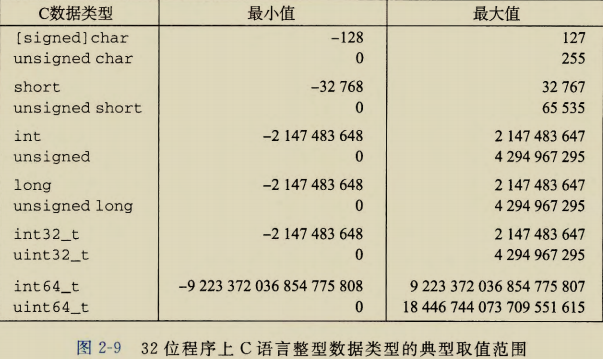{ width="800"}
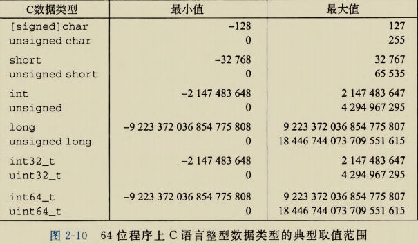{ width="800"}

&emsp;&emsp;图2-9 和图 2-10 中一个很值得注意的特点是取值范围不是对称的 负数的范围比整
数的范围大 。当我们考虑如何表示负数的时候，会看到为什么会这样。  
&emsp;&emsp;C语言标准定义了每种数据类型必须能够表示的最小的取值范围。如图 11 所示，它
们的取值范围与图 2-9 和图 2-10 所示的典型实现一样或者小一些。特别地，除了固定大小
的数据类型是例外，我们看到它们只要求正数和负数的取值范围是对称的。此外，数据类型
int 可以用 个字节的数字来实现，而这几乎回退到了 16 位机器的时代。还可以看到，
long 的大小可以用 个字节的数字来实现，对 32 位程序来说这是很典型的。固定大小的数
据类型保证数值的范围与图 2-9 给出的典型数值一致，包括负数与正数的不对称性。  
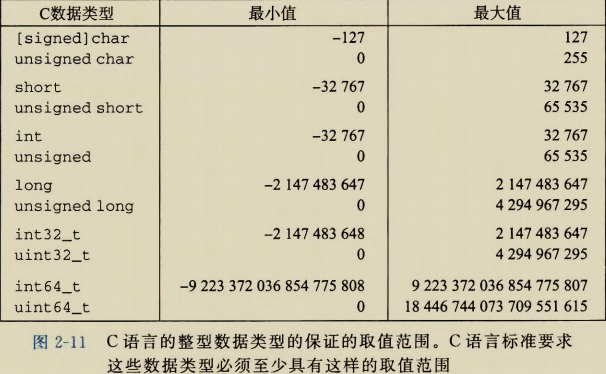{ width="800"}

---
<font color=Blue>给C语言初学者</font> C、C++ 和 Java 中的有符号和无符号数  
&emsp;&emsp;C 和 C++ 都支持有符号（默认）和无符号数。 Java 只支持有符号数。
---

## 2.2.2 无符号数的编码  

&emsp;&emsp;假设有一个整数数据类型有 位。我们可以将位向量写成立表示整个向量，或者写
成$[X_{w-1}, X_{w- 2}, \cdots, x_0]$ 表示向量中的每一位。把 看做一个二进制表示的数，就获得
了$\vec{x}$ 的无符 表示。在这个编码中，每个位$x_i$都取值为0或 1, 后一种取值意味着数值 $2^i$
为数字值的一部分 我们用一个函数 $B2U_w$ (Binary to Unsigned 的缩写，长度为 w) 来表示：  
&emsp;&emsp;原理：无符号数编码的定义  
&emsp;&emsp;
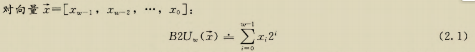{ width="800"}
在这个等式中，符号”$\doteq$”表示左边被定义为等千右边。函数 $BZU_w$ 将一个长度为 w 的
0、 1 串映射到非负整数。举一个示例，图 11 展示的是下面几种情况下 BZU 给出的从位
向最到整数的映射：  
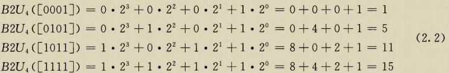{ width="800"}
&emsp;&emsp;在图中，我们用长度为 $2_i$ 的指向右侧箭头的条表示每个位的位置 。每个位向械对应
的数值就等于所有值为 的位对应的条的长度之和。  
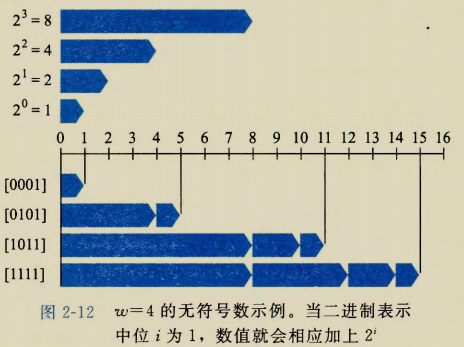{ width="800"}
&emsp;&emsp;让我们来考虑一下 w 位所能表示
的值的范围。最小值是用位向量$[00\cdots0]$表示，也就是整数值0, 而最大值是 
用位向量$[11\cdots1]$表示，也就是整数值$UMax_w\doteq\sum_{i=0}^{w-1}2^i=2^w-1$。
以 4 位情况为例， $UMax_{4}=B2U_{4}\left(\left[1111\right]\right)=2^{4}-1=15$。
因此，函数 $B2U_w$ 能够被定义 为一个映射$B2U_{w}:\left\{0,1\right\}^{w}\to\left\{0,\cdots,2^w-1\right\}$。  
&emsp;&emsp;无符号数的二进制表示有一个很重要的属性，也就是每个介于 0~$2^w-1$ 之间的数都
有唯一一个 w 位的值编码。例如，十进制值 11 作为无符号数，只有一个 4 位的表示，即
[1011]。 我们用数学原理来重点讲述它，先表述原理再解释。  
&emsp;&emsp;原理：无符号数编码的唯一性  
&emsp;&emsp;函数 $B2U_w$ 是一个双射。  
&emsp;&emsp;数学术语双射是指一个函数 f有两面：它将数值 x 映射为数值y, 即 $y=f(x)$，但它
也可以反向操作，因为对每一个 y 而言，都有唯一一个数值 x 使得$f(x)=y$。这可以用反函数$f^{-1}$来表示，在本例中，即$x=f^{-1}(x)$。
函数$B2U_w$将每一个长度为 w 的位向量都映
射为 0~$2^w-1$ 之间的一个唯一值；反过来，我们称其为 $U2B_w$（即“无符号数到二进制"),
在 0~$2^w-1$ 之间的每一个整数都可以映射为一个唯一的长度为 w 的位模式。  

## 2.2.3 补码编码  

&emsp;&emsp;对于许多应用，我们还希望表示负数值。最常见的有符号数的计算机表示方式就是补
码(two's-complement) 形式。在这个定义中，将字的最高有效位解释为负权 (negative
weight) 。我们用函数 $B2T_w$(Binary to Two's-complement 的缩写，长度为 w)来表示 ：  
&emsp;&emsp;原理：补码编码的定义  
&emsp;&emsp;对向量 $x=[x_{w-1}, X_{w-2}, \cdots, X_0]$:

$$
B2T_{w}(\vec{x})\doteq-\:x_{w-1}2^{w-1}+\sum_{i=0}^{w-2}x_{i}2^{i}
\quad\quad\quad\quad\quad\quad(2.3)
$$

&emsp;&emsp;最高有效位 $x_{w-1}也称为符号位，它的＂权重”为$—2_{w-1}, 是无符号表示中权重的负
数。符号位被设置为 1 时，表示值为负，而当设置为 0 时，值为非负。这里来看一个示
例，图 2-13 展示的是下面几种情况下 B2T 给出的从位向最到整数的映射。

$$
\begin{aligned}
B2T_4(\begin{bmatrix}0001\end{bmatrix})&=-0\cdot2^3+0\cdot2^2+0\cdot2^1+1\cdot2^0&=\quad0+0+0+1&=\quad1\\
B2T_4(\begin{bmatrix}0101\end{bmatrix})&=-0\cdot2^3+1\cdot2^2+0\cdot2^1+1\cdot2^0&=\quad0+4+0+1&=\quad5\\
B2T_4(\begin{bmatrix}1011\end{bmatrix})&=-1\cdot2^3+0\cdot2^2+1\cdot2^1+1\cdot2^0&=-8+0+2+1&=-5\\
B2T_4(\begin{bmatrix}1111\end{bmatrix})&=-1\cdot2^3+1\cdot2^2+1\cdot2^1+1\cdot2^0&=-8+4+2+1&=-1
\end{aligned}(2.4)
$$

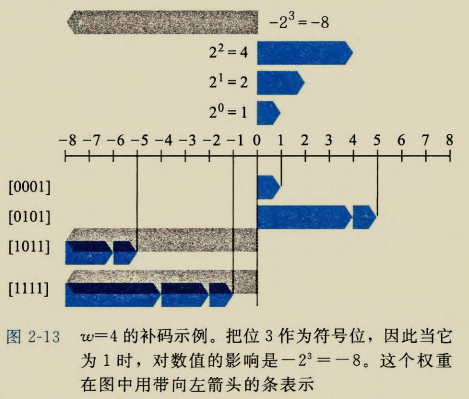{ width="800" }
&emsp;&emsp;在这个图中，我们用向左指的条表 示符号位具有负权重。于是，与一个位
向量相关联的数值是由可能的向左指的条和向右指的条加起来决定的。  
&emsp;&emsp;我们可以看到，图 2-12 和图 2-13
中的位模式都是一样的，对等式(2. 2)
和等式(2.4)来说也是一样，但是当最
高有效位是 1 时，数值是不同的，这是
因为在一种情况中，最高有效位的权重
是十8, 而在另一种情况中，它的权重是一8。  
&emsp;&emsp;让我们来考虑一下 w 位补码所能
表示的值的范围。它能表示的最小值是
位向量$[10\cdots0]$(也就是设置这个位为负
权，但是清除其他所有的位），其整数值为$TMin_w\doteq-2^{w-1}$ 。而最大值是位向量$[01\cdots1]$
（清除具有负权的位，而设置其他所有的位），其整数值为 $TMax_w\doteq\sum_{i=0}^{w-2}2^i=2^{w-1}-1$。以
长度为 4 为例，我们有 $TMin_{4}=B2T_{4}\left(\left[1000\right]\right)=-2^{3}=-8$, 
而 $TMax_{4}=B2T_{4}\left(\left[0111\right]\right)=2^2+2^1+2^0=4+2+1$  
&emsp;&emsp;我们可以看出 $B2T_w$是一个从长度为 w 的位模式到$TMin_w$和 $TMax_w$之间数字的映
射，写作 $B2T_w:\langle0,1\rangle^w\rightarrow\langle TMin_w,\cdotp\cdotp,TMax_w\rangle $ 。
同无符号表示一样，在可表示的取
值范围内的每个数字都有一个唯一的 w 位的补码编码。这就导出了与无符号数相似的补码
数原理：  
&emsp;&emsp;原理：补码编码的唯一性  
&emsp;&emsp;函数 $B2T_w$是一个双射。  
&emsp;&emsp;我们定义函数 $T2B_w$(即“补码到二进制")作为 $B2T_w$的反函数。也就是说，对于每个
数 x, 满足 $TMin_w\le x\le TMax_w$，则 $T2B_w(x)$是 x 的（唯一的）w 位模式。  

><font color=Blue>练习题 2. 17</font> 假设 w=4, 我们能给每个可能的十六进制数字赋予一个数值，假设用
一个无符号或者补码表示。请根据这些表示，通过写出等式(2. 1)和等式(2. 3)所示的
求和公式中的 2 的非零次幕，填写下表：  

<table align="center" border="1" cellspacing="0" cellpadding="0">
    <tr align="center">
        <td colspan="2">
            \begin{align}
            \vec{x} 
            \end{align}
        </td> 
        <td rowspan="2">
            \begin{align}
            B2U_4(\vec{x}) 
            \end{align}
        </td> 
        <td rowspan="2">
            \begin{align}
            B2T_4(\vec{x})
            \end{align}
        </td> 
   </tr>
    <tr align="center">
  		<td>十六进制</td> 
        <td>二进制</td>
    </tr>
    <tr align="center">
  		<td>0xE</td> 
        <td>[1110]</td>
        <td>
            \begin{align}
            2^3+2^2+2^1=14 
            \end{align}
        </td> 
        <td>
            \begin{align}
            -2^3+2^2+2^1=-2
            \end{align}
        </td> 
    </tr>
    <tr align="center">
  		<td>0x0</td> 
        <td></td>
        <td></td> 
        <td></td>
    </tr>
    <tr align="center">
  		<td>0x5</td> 
        <td></td>
        <td></td> 
        <td></td>
    </tr>
    <tr align="center">
  		<td>0x8</td> 
        <td></td>
        <td></td> 
        <td></td>
    </tr>
    <tr align="center">
  		<td>0xD</td> 
        <td></td>
        <td></td> 
        <td></td>
    </tr>
    <tr align="center">
  		<td>0xF</td> 
        <td></td>
        <td></td> 
        <td></td>
    </tr>
</table>

>&emsp;&emsp;图 2-14 展示了针对不同字长，几个重要数字的位模式和数值。前三个给出的是可表
示的整数的范围，用 $UMax_w$、 $TMin_w$ 和 $TMax_w$ 来表示。在后面的讨论中，我们还会经
常引用到这三个特殊的值。如果可以从上下文中推断出 w, 或者 w 不是讨论的主要内容
时，我们会省略下标 W, 直接引用 $UMax$、 $TMin$ 和 $TMax$。  
 
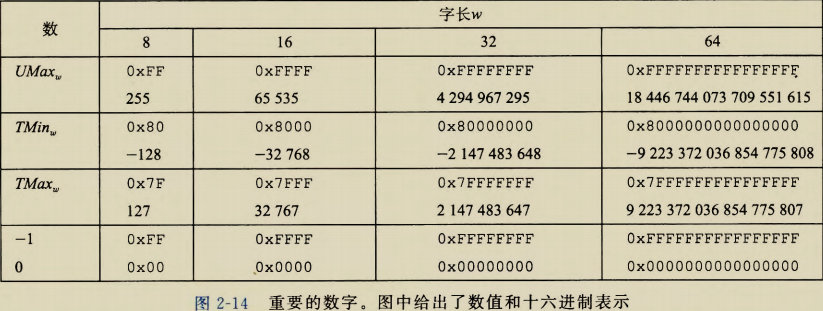{ width="800" }

>&emsp;&emsp;关千这些数字，有几点值得注意。第一，从图 2-9 和图 2-10 可以看到，补码的范围是
不对称的： $|TMin| = |TMax| + 1$, 也就是说， $TMin$没有与之对应的正数。正如我们将
会看到的，这导致了补码运算的某些特殊的属性，并且容易造成程序中细微的错误。之所
以会有这样的不对称性，是因为一半的位模式（符号位设置为 1 的数）表示负数，而另一半
（符号位设置为 0 的数）表示非负数。因为 0 是非负数，也就意味着能表示的整数比负数少
一个。 第二，最大的无符号数值刚好比补码的最大值的两倍大一点： $UMax_w=2TMax_w十
1$。 补码表示中所有表示负数的位模式在无符号表示中都变成了正数。图 2-14 也给出了常
数一1 和 0 的表示。注意一1 和 $UMax$有同样的位表示一一一个全 1 的串。数值 0 在两种
表示方式中都是全 0 的串。  
&emsp;&emsp;C 语言标准并没有要求要用补码形式来表示有符号整数，但是几乎所有的机器都是这
么做的。 程序员如果希望代码具有最大可移植性，能够在所有可能的机器上运行，那么除
了图 2-11 所示的那些范围之外，我们不应该假设任何可表示的数值范围，也不应该假设
有符号数会使用何种特殊的表示方式。另一方面，许多程序的书写都假设用补码来表示有
符号数，并且具有图 2-9 和图 2-10 所示的＂典型的”取值范围，这些程序也能够在大量的
机器和编译器上移植。 C 库中的文件＜limits.h>定义了一组常量，来限定编译器运行的
这台机器的不同整型数据类型的取值范围。比如，它定义了常量 INT_MAX、 INT_M工N 和
UINT_MAX, 它们描述了有符号和无符号整数的范围。对于一个补码的机器，数据类型 int
有 w 位，这些常量就对应千 $UMax_w$、 $TMin_w$ 和 $TMax_w$的值。  

---
><font color=Blue>旁注</font> 关千确定大小的整数类型的更多内容  
&emsp;&emsp;对于某些程序来说， 用某个确定大小的表示来编码数据类型非常重要。 例如，当编写程序，
使得机器能够按照一个标准协议在因特网上通信时，让数据类型与协议指定的数据类型兼容是
非常重要的。 我们前面看到了，某些 C数据类型，特别是 long型，在不同的机器上有不同的取
值范围，而实际上 C语言标准只指定了每种数据类型的最小范围，而不是确定的范围。 虽然我
们可以选择与大多数机器上的标准表示兼容的数据类型，但是这也不能保证可移植性。  
&emsp;&emsp;我们已经见过了 32 位和 64 位版本的确定大小的整数类型（图 2-3), 它们是一个更
大数据类型类的一部分。 ISO C99 标准在文件 stdint.h 中引入了这个整数类型类。 这
个文件定义了一组数据类型，它们的声明形如 int*N*_t 和 uint*N*_t，对不同的 N 值指定
N位有符号和无符号整数。 N 的具体值与实现相关，但是大多数编译器允许的值为 8、
16、 32 和 64。 因此，通过将它的类型声明为 uint16_t, 我们可以无歧义地声明一个 16
位无符号变量，而如果声明为 int32_t, 就是一个 32 位有符号变量。  
&emsp;&emsp;这些数据类型对应着一组宏，定义了每个 N 的值对应的最小和最大值。 这些宏名字
形如 INT*N*_MIN、 INT*N*_MAX 和 UINT*N*_MAX。  
&emsp;&emsp;确定宽度类型的带格式打印需要使用宏，以与系统相关的方式扩展为格式串 。 因
此，举个例子来说，变量 x 和 y 的类型是 int32_t 和 uint64_t, 可以通过调用 printf
来打印它们的值，如下所示：  
&emsp;&emsp;printf("x = %" PRId32 ", y = %" PRIu64 "\n", x, y);  
编译为 64 位程序时，宏 PRId32 展开成字符串 "d"' 宏 PRIu64 则展开成两个宇符串
"1" "u"。 当 C 预处理器遇到仅用空格（或其他空白宇符）分隔的一个字符串常量序列时，
就把它们串联起来。 因此，上面的 printf 调用就变成了：  
&emsp;&emsp;printf("x = %d, y = %1u\n", x, y);  
使用宏能保证：不论代码是如何被编译的，都能生成正确的格式宇符串 。

---
&emsp;&emsp;关于整数数据类型的取值范围和表示， Java 标准是非常明确的。它要求采用补码表示，取
值范围与图 2-10 中 64 位的情况一样。 在Java 中，单字节数据类型称为 byte, 而不是 char。这
些非常具体的要求都是为了保证尤论在什么机器上运行， Java 程序都能表现地完全一样。

---
><font color=Blue>旁注</font>  有符号数的其他表示方法  
&emsp;&emsp;有符号数还有两种标准的表示方法：  
&emsp;&emsp;反码(Ones' Complement): 除了最高有效位的权是$-(2^{w-1} - 1)$ 而不是$-2^{w-1}$ , 它
和补码是一样的：  

$$
B2O_{w}(\vec{x})\doteq-x_{w-1}(2^{w-1}-1)+\sum_{i=0}^{w-2}{x_i}{2^i}
$$

&emsp;&emsp;原码(Sign-Magnitude): 最高有效位是符号位，用来确定剩下的位应该取负权还是正权： 

$$
B2S_{w}\left(\vec{x}\right)\doteq\left(-1\right)^{x}_{w-1}\bullet(\sum_{i=0}^{w-2}{x_i}{2^i})
$$

&emsp;&emsp;这两种表示方法都有一个奇怪的属性，那就是对于数字 0 有两种不同的编码方式。
这两种表示方法，把$[00\cdots0]$都解释为 十0。 而值一0 在原码中表示为 $[10\cdots0]$, 在反码
中表示为$[11\cdots1]$。 虽然过去生产过基于反码表示的机器，但是几乎所有的现代机器都
使用补码。 我们将看到在浮点数中有使用原码编码。  
&emsp;&emsp;请注意补码(Two's complement)和反码(Ones'complement) 中撇号的位置是不同
的 。 术语补码来源于这样一个情况，对于非负数 x, 我们用 沪-x(这里只有一个 2)来
计算-x 的 w 位表示。术语反码来源于这样一个属性，我们用$[111\cdots1]-x$(这里有很多
个 1)来计算一x 的反码表示。  

---
&emsp;&emsp;为了更好地理解补码表示， 考虑下面的代码：  

```commandline
short x = 12345;
short mx = -x;
show_bytes((byte_pointer) &x, sizeof(short));
show_bytes((byte_pointer) &mx, sizeof(short));
```

当在大端法机器上运行时，这段代码的输出为 30 39 和 cf c7, 指明 x 的十六进制表
示为 0x3039, 而 mx 的十六进制表示为 0xCFC7。将它们展开为二进制，我们得到 x 的位
模式为[0011000000111001], 而 mx 的位模式为[110011111100011l]。如图 2-15 所示，等
式(2. 3)对这两个位模式生成的值为 12 345 和—12 345。
    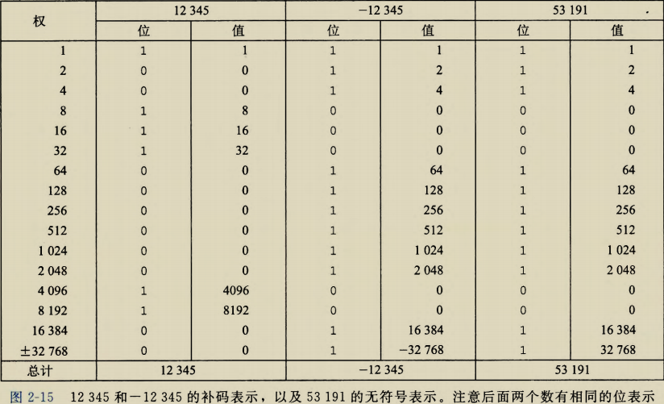{ width="800" }

---
><font color=Blue>练习题 2. 18</font>  在第 3 章 中 ，我们将看到 由 反汇编器生成 的列表，反汇编器是一种将可
执行程序文件转换 回可读性更好的 ASCII 码形式的程序。这些文件包含许多 十六进制
数字 ，都是用典型 的补码形式来表 示这 些值。能够认识这 些 数 字 并理解 它 们的意义
（例如它们是正数还是负数），是一项 重要 的技巧 。  
&emsp;&emsp;在下面的列表中，对千标号为 A~I(标记在右边）的那些行，将指令名 (sub、 mov
和 add)右边显示 的(32 位补码形式表示的）十 六进制 值转换为 等价的十进制值。  

```text
4004d0: 48 81 ec eO 02 00 00 sub $0x2e0,%rsp A.
4004d7: 48 8b 44 24 a8 mov -Ox58(%rsp) 丛rax B.
4004dc: 48 03 47 28 add Ox28(%rdi),%rax C.
4004e0: 48 89 44 24 dO mov %rax,-Ox30(%rsp) D.
4004e5: 48 8b 44 24 78 mov Ox78(%rsp),%rax E.
4004ea: 48 89 87 88 00 00 00 mov %rax,Ox88(%rdi) F.
4004f1: 48 8b 84 24 f8 01 00 mov Ox1f8(%rsp) ,%rax G.
4004f8: 00
4004f9: 48 03 44 24 08 add Ox8(%rsp),%rax
4004fe: 48 89 84 24 co 00 00 mov %rax,Oxc0(%rsp) H.
400505: 00
400506: 48 8b 44 d4 b8 mov -Ox48(%rsp,%rdx,8),%rax I. 
```

## 2.2.4 有符号数和无符号数之间的转换  

&emsp;&emsp;C语言允许在各种不同的数字数据类型之间做强制类型转换。例如，假设变量 x 声明
为int, u 声明为 unsigned。表达式 (unsigned)x 会将 x 的值转换成一个无符号数值，而
(int) u 将 u 的值转换成一个有符号整数。将有符号数强制类型转换成无符号数，或者反
过来，会得到什么结果呢？从数学的角度来说，可以想象到几种不同的规则。很明显，对
于在两种形式中都能表示的值，我们是想要保持不变的。另一方面，将负数转换成无符号
数可能会得到 0。如果转换的无符号数太大以至千超出了补码能够表示的范围，可能会得
到$TMax$。不过，对千大多数 C 语言的实现来说，对这个问题的回答都是从位级角度来看
的，而不是数的角度。  
&emsp;&emsp;比如说，考虑下面的代码：
```commandline
1 short int v =一12345;
2 unsigned short uv = (unsigned short) v;
3 printf("v = %d, uv = %u\n", v, uv);
```

在一台采用补码的机器上，上述代码会产生如下输出： 
```text
V = -12345, UV= 53191  
```

我们看到，强制类型转换的结果保持位值不变，只是改变了解释这些位的方式。在图 2-15
中我们看到过，一12 345 的 16 位补码表示与 53 191 的 16 位无符号表示是完全一样的。将
short 强制类型转换为 unsigned sho江改变数值，但是不改变位表示。
类似地，考虑下面的代码：  
```commandline
1 unsigned u = 4294967295u; /* UMax */
2 int tu= (int) u;
3 printf("u = %u, tu = %d\n", u, tu);
```

在一台采用补码的机器上，上述代码会产生如下输出：  
```text
u = 4294967295, tu= -1
```

&emsp;&emsp;从图 2-14 我们可以看到，对千 32 位字长来说，无符号形式的 4 294 967 295($UMax_32$)
和补码形式的—1 的位模式是完全一样的。将 unsigned 强制类型转换成 int, 底层的位
表示保持不变。  
&emsp;&emsp;对于大多数 C语言的实现，处理同样字长的有符号数和无符号数之间相互转换的一般规
则是：数值可能会改变，但是位模式不变。让我们用更数学化的形式来描述这个规则。我们
定义函数 $U2B_w,和 T2B_w$, 它们将数值映射为无符号数和补码形式的位表示。也就是说，给
定 $0\le x \le UMax_w$范围内的一个整数 X, 函数 $U2B_w(x)$会给出 x 的唯一的 w 位无符号表示。
相似地，当 x 满足 $TMin_w\le x \le TMax_w$，函数 $T2B_w(x)$会给出 x 的唯一的 w位补码表示。   

&emsp;&emsp;现在，将函数 $T2U_w$定义为 $T2Uw(x)\doteq B2U_w(T2B_w(x))$。这个函数的输入是一个
$TMin_w$~$TMax_w$的数，结果得到一个 0~$UMax_w$ 的值，这里两个数有相同的位模式，除
了参数是无符号的，而结果是以补码表示的。类似地，对千 0~$UMax心_w$ 之间的值 x, 定义函
数 $U2T_w为U2T_w(x)\doteq B2T_w(U2B_w(x))$。 生成一个数的无符号表示和 x 的补码表示相同。  

&emsp;&emsp;继续我们前面的例子，从图 2-15 中 ， 我们看到 $T2U_16$ ( —12 345) =53 191, 并且
$U2T_16$ (53 191) =— 12 345。也就是说，十六进制表示写作 0xCFC7 的 16 位位模式既是
-12 345的补码表示，又是 53 191 的无符号表示。 同时请注意 12 345+ 53 191=65 536=
$2^{16}$ 。这个属性可以推广到给定位模式的两个数值（补码和无符号数）之间的关系。类似地，
从图 2-14 我们看到 $T2U_32(—1)$= 4294967295, 并且 $U2T_32(4 294 967 295)$=-1。也就是
说，无符号表示中的 $UMax$ 有着和补码表示的一1 相同的位模式。我们在这两个数之间也
能看到这种关系： $1+UMax_w=2^w$。  

&emsp;&emsp;接下来，我们看到函数 $U2T$ 描述了从无符号数到补码的转换，而 T2U 描述的是补码
到无符号的转换。这两个函数描述了在大多数 C 语言实现中这两种数据类型之间的强制类
型转换效果。  

><font color=Blue>练习题 2. 19</font> 利用你解答练习题 2. 17 时填写的表格，填写下列描述函数 $T2U_4$的表格。

<table border=”1″ cellpadding=1 align="center" width="300px" class="table_2_19">
    <tr>
        <td>
            \begin{align}
            x
            \end{align}
        </td> 
        <td>
            \begin{align}
            T2U_2(x)
            \end{align}
        </td>
   </tr>
    <tr align="center">
        <td>-8</td>
        <td></td>
    </tr>
    <tr align="center">
        <td>-3</td>
        <td></td>
    </tr>
    <tr align="center">
        <td>-2</td>
        <td></td>
    </tr>
    <tr align="center">
        <td>-1</td>
        <td></td>
    </tr>
    <tr align="center">
        <td>0</td>
        <td></td>
    </tr>
    <tr align="center">
        <td>5</td>
        <td></td>
    </tr>
</table>

>&emsp;&emsp;通过上述这些例子，我们可以看到给定位模式的补码与无符号数之间的关系可以表示
为函数 $T2U$ 的一个属性：  
&emsp;&emsp;原理：补码转换为无符号数  
&emsp;&emsp;对满足 $TMin_w\le x \le TMax_w$ 的 x 有：  

$$
\left.T2U_w(x)=\left|\begin{matrix}x+2^w,&x<0\\x,&x\geqslant0\end{matrix}\right.\right.
\quad\quad\quad\quad\quad\quad(2.5)
$$

&emsp;&emsp;比如，我们看到 $T2U_16(—12 345)=—12 345+2^16=53191$, 同时 $T2U_w(-1)=-1+
2^w=UMax_w$。  
&emsp;&emsp;该属性可以通过比较公式(2. 1)和公式(2. 3)推导出来。  

&emsp;&emsp;推导：补码转换为无符号数  

&emsp;&emsp;比较等式(2. 1)和等式(2. 3), 我们可以发现对千位模式 $\vec{x}$，如果我们计算 $B2U_w(\vec{x})-
B2T_w(\vec{x})$之差，从 0 到 w-2 的位的加权和将互相抵消掉，剩下一个值： $B2U_w(\vec{x})-
B2T_w(\vec{x})＝x_{w-1} (2^{w-1} - (-2^{w-1})) =x_{w-1}2^w$。
这就得到一个关系： $BZU_w(\vec{x})=x_{w-1}2^w+B2T_W(\vec{x})$。我
们因此就有 .
$$
B2U_{w}(T2B_{w}(x))=T2U_{w}(x)=x+x_{w-1}2^{w}
\quad\quad\quad\quad\quad\quad(2.6)
$$

&emsp;&emsp;根据公式(2. 5)的两种情况，在 x 的补码表示中，位 Xw-1决定了 x 是否为负。 

&emsp;&emsp;比如说，图 2-16 比较了当 w=4 时函数 $B2U$ 和 $B2T$ 是如何将数值变成位模式的。 对
补码来说，最高有效位是符号位，我们用带向左箭头的条来表示。对千无符号数来说，最
高有效位是正权重，我们用带向右的箭头的条来表示。从补码变为无符号数，最高有效位
的权重从一8 变为十8。因此，补码表示的负数如果看成无符号数，值会增加 $2^4$ = 16。因
而， -5 变成了十11, 而—1 变成了十15。
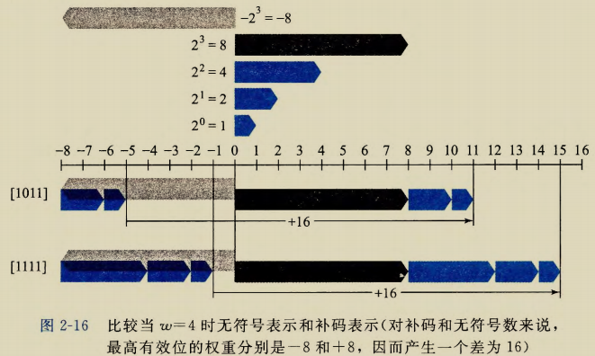{ width="800" }

&emsp;&emsp;图 2-17 说明了函数 $T2U$ 的一般行为。如图所示，当将一个有符号数映射为它相应的
无符号数时，负数就被转换成了大的正数，而非负数会保待不变。

<font color=Blue>练习题 2. 20</font>  请说明等式(2. 5)是如何应用到解答练习题 2. 19 时生成的表格中的各项的。  
&emsp;&emsp;反过来看，我们希望推导出一个尤符号数 u 和与之对应的有符号数 $U2T_w(u)$之间的关系：  
&emsp;&emsp;原理：无符号数转换为补码  
&emsp;&emsp;对满足 $0 \le u \le UMax_w$ 的 u 有：

$$
U2T_w(u)=\begin{cases}u,&u\leqslant TMax_w\\u-2^w,&u>TMax_w\end{cases}
\quad\quad\quad\quad\quad\quad(2.7)
$$

&emsp;&emsp;该原理证明如下：  

&emsp;&emsp;推导：无符号数转换为补码  
&emsp;&emsp;设$\vec{u}=U2B_w(u)$, 这个位向量也是$U2T_w(u)$的补码表示。公式(2. 1)和公式(2. 3)结合起来有

$$
U2T_w(u)=-u_{w-1}2^w+u
\quad\quad\quad\quad\quad\quad(2.8)
$$

&emsp;&emsp;在 u 的无符号表示中，对公式 (2. 7) 的两种情况来说，位 $u_{w-1}$ 决定了 u 是否大于
$TMax_w=2^{w-1} -1$。  

&emsp;&emsp;图 2-18 说明了函数 $U2T$ 的行为。对于小的数($\le TMax_w$), 从无符号到有符号的转换
将保留数字的原值.。对 于大的数($> TMax_w$），数字将被转换为一个负数值。
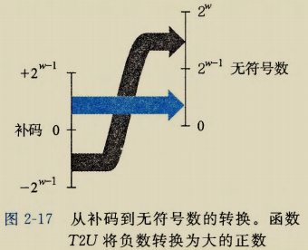{ width="350" }
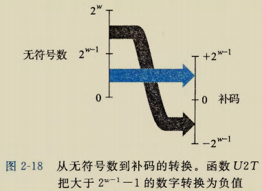{ width="390" }

&emsp;&emsp;总结一下，我们考虑无符号与补码表示之间互相转换的结果。对于在范围 $0 \le x \le 
TMax_w$ 之内的值x 而言，我们得到 $T2U_w(x)=x$ 和 $U2T_w(x) =x$。也就是说，在这个范
围内的数字有相同的无符号和补码表示。 对千这个范围以外的数值，转换需要加上或者减
去$2^w$。例如，我们有 $T2U_w(-1)= -1 +2^w=UMax_w$ --最靠近 0 的负数映射为最大的无
符号数。在另一个极端，我们可以看到 $T2U_w(TMin_w) =—2^{w-1} + 2^w= 2^{w-1}$ 
$= TMax_w +1$ --最小的负数映射为一个刚好在补码的正数范围之外的无符号数。使用图 2-15 的示
例，我们能看到 $T2U_{16}(-12\:345)=65\:563+-12\:345=53\:191$。  

## 2.2.5 C 语言中的有符号数与无符号数  

&emsp;&emsp;如图 2-9 和图 2-10 所示， C 语言支持所有整型数据类型的有符号和无符号运算。 尽管
C 语言标准没有指定有符号数要采用某种表示，但是儿乎所有的机器都使用补码。通常，
大多数数字都默认为是有符号的。例如，当声明一个像 12345 或者 Ox1A2B 这样的常量时，
这个值就被认为是有符号的。要创建一个无符号常量，必须加上后缀字符 'u' 或者 'u',
例如， 123450 或者 0x1A2Bu。
C 语言允许无符号数和有符号数之间的转换。虽然 C 标准没有精确规定应如何进行这
种转换，但大多数系统遵循的原则是底层的位表示保持不变。因此，在一台采用补码的机
器上，当从无符号数转换为有符号数时，效果就是应用函数 $U2T_w$, 而从有符号数转换为
无符号数时，就是应用函数 $T2U_w$, 其中 w 表示数据类型的位数。  
&emsp;&emsp;显式的强制类型转换就会导致转换发生，就像下面的代码：  
```commandline
int tx, ty;
unsigned ux, uy;
tx = (int) ux;
uy = (unsigned) ty;
```

&emsp;&emsp;另外，当一种类型的表达式被赋值给另外一种类型的变鼠时，转换是隐式发生的，就
像下面的代码：  
```commandline
int tx, ty;
unsigned ux, uy;
tx = ux; /* Cast to signed */
uy = ty; /* Cast to unsigned */
```

&emsp;&emsp;当用 printf 输出数值时，分别用指示符%ct、%u 和%x 以有符号十进制、无符号十进制
和十六进制格式输出一个数字。注意 print£ 没有使用任何类型信息，所以它可以用指示
符%u 来输出类型为 i正的数值，也可以用指示符%d输出类型为 unsigned 的数值。例如，
考虑下面的代码：  
```commandline
in t X = -1;
unsigned u = 2147483648; /* 2 to the 31st */
printf("x = %u = %d\n", x, x);
printf("u = %u = %d\n", u, u);
```

当在一个 32 位机器上运行时，它的输出如下：  
```text
X = 4294967295 = -1
u = 2147483648 = -2147483648 
```
 
&emsp;&emsp;在这两种情况下， printf首先将这个字当作一个无符号数输出，然后把它当作一个有
符号数输出。以下是实际运行中的转换函数：  
$$
&emsp;&emsp;$T2U_{32} (-1) =UMax_{32} = 2^{32}-1 和 U2T_{32}(2^{31})=
2^{31} - 2^{32}= - 2^{31} = TMin_{32} 。  
$$
&emsp;&emsp;由于 C 语言对同时包含有符号和无符号数表达式的这种处理方式，出现了一些奇特的
行为。当执行一个运算时，如果它的一个运算数是有符号的而另一个是无符号的，那么 C
语言会隐式地将有符号参数强制类型转换为无符号数，并假设这两个数都是非负的，来执
行这个运算。就像我们将要看到的，这种方法对于标准的算术运算来说并无多大差异，但
是对于像＜和＞这样的关系运算符来说，它会导致非直观的结果。图 2-19 展示了一些关
系表达式的示例以及它们得到的求值结果，这里假设数据类型 int 表示为 32 位补码。考
虑比较式- 1<0U。因为第二个运算数是无符号的，第一个运算数就会被隐式地转换为无符
号数，因此表达式就等价于 4294 9672 95U<0U(回想 $T2U_w(-1)=UMax_w)$, 这个答案显然
是错的。其他那些示例也可以通过相似的分析来理解。  
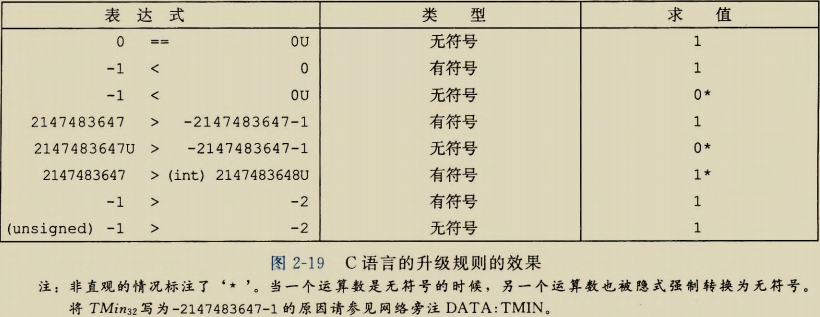{ width="800" }

><font color=Blue>练习题 2. 21</font>&emsp;&emsp;假设在采用补码运算的 32 位机器上对这些表达式求值，按照图 2-19 的
格式填写下表，描述强制类型转换和关系运算的结果。  
<table border=”1″ cellpadding=1>
    <tr>
        <td align="center" width="40%">表达式</td> 
        <td align="center">类型</td> 
        <td align="center">求值</td>
   </tr>
    <tr>
        <td>-2147483647-1 == 2147483648U</td> 
        <td></td> 
        <td></td>
   </tr>
    <tr>
        <td>-2147483647-1 < 2147483647</td> 
        <td></td> 
        <td></td>
   </tr>
    <tr>
        <td>-2147483647-1U < 2147483647</td> 
        <td></td> 
        <td></td>
   </tr>
    <tr>
        <td>-2147483647-1 < -2147483647</td> 
        <td></td> 
        <td></td>
   </tr>
    <tr>
        <td>-2147483647-1U < -2147483647</td> 
        <td></td> 
        <td></td>
   </tr>
</table>

---
><font color=Blue>网络旁注DATA:TMIN</font> C 语言中 TMin 的写法  
&emsp;&emsp;在图 2-19 和练习题 2. 21 中， 我们很小心地将 $TMin_{32}$写成-2147483647-1。 为什么
不简单地写成-2147483648 或者 0x80000000? 看一下 C 头文件 limits.h, 注意到它们
使用了跟我们写 $TMin_{32}和 TMax_{32}$类似的方法：  
```commandline
/ * Minimum and maximum values a'signed int'can hold. */
#define INT_MAX 2147483647
#define INT_MIN (-INT_MAX 一 1)  
```

>&emsp;&emsp;不幸的是，补码表示的不对称性和 C 语言的转换规则之间奇怪的交互 ， 迫使我们用54 笫一部分程序结构和执行
这种不寻常的方式来写 TMin32 。 虽然理解这个问题需要我们钻研 C 语言标准的一些比
较隐晦的角落，但是它能够帮助我们充分领会整数数据类型和表示的一些细微之处。  

## 2.2.6 扩展一个数字的位表示  

&emsp;&emsp;一个常见的运算是在不同字长的整数之间转换，同时又保持数值不变。当然，当目标
数据类型太小以至于不能表示想要的值时，这根本就是不可能的。然而，从一个较小的数
据类型转换到一个较大的类型，应该总是可能的。  
&emsp;&emsp;要将一个无符号数转换为一个更大的数据类型，我们只要简单地在表示的开头添加 0。
这种运算被称为零扩展(zero extension) , 表示原理如下：  
&emsp;&emsp;原理：无符号数的零扩展  
&emsp;&emsp;定义宽度为 w 的位向量 $\vec{u}$＝$[u_{w-1},u_{w-2},\cdots,u_0]$和宽度为 $w^\prime$的位向量
$\vec{u}^\prime$＝$[0, \cdots,0,u_{w-1},u_{w-2},\cdots,u_0]$  其中 $w^\prime>w$。则$B2U_w(\vec{u})=B2U_{w^\prime}(\vec{u}^\prime)$。  
&emsp;&emsp;按照公式(2. 1)' 该原理可以看作是直接遵循了无符号数编码的定义。  
&emsp;&emsp;要将一个补码数字转换为一个更大的数据类型，可以执行一个符号扩展(sign exten
sion), 在表示中添加最高有效位的值，表示为如下原理。 我们用蓝色标出符号位$x_{w-1}$来
突出它在符号扩展中的角色。  
&emsp;&emsp;原理：补码数的符号扩展  
&emsp;&emsp;定义宽度为 w 的位向量 $\vec{x}$＝$[x_{w-1},x_{w-2},\cdots,x_0]$和
宽度为 w 的位向量$\vec{x}^\prime$＝$[x_{w-1}, \cdots,x_{w-1},x_{w-1},x_{w-2},\cdots,x_0]$ 
其中 $w^\prime>w$。则 $B2T_w(\vec{x})=B2T_{w^\prime}(\vec{x}^\prime)$ 。  
&emsp;&emsp;例如，考虑下面的代码：  
```commandline
short sx = -12345; /* -12345 */
unsigned short usx = sx; /* 53191 */
int x = sx; /* 一12345 */
unsigned ux = usx; /* 53191 */
printf("sx = %d:\t", sx);
show_bytes((byte_pointer) &sx, sizeof(short));
printf("usx = %u:\t", usx);
show_bytes((byte_pointer) &usx, sizeof(unsigned short));
printf("x = %d:\t", x);
show_bytes((byte_pointer) &x, sizeof(int));
printf ("ux = %u: \t", ux);
show_bytes ((byte_pointer) &ux, sizeof(unsigned));  
```

在采用补码表示的 32 位大端法机器上运行这段代码时，打印出如下输出：  
```text
sx  = -12345: cf c7  
usx = 53191:  cf c7  
X   = -12345: ff ff cf c7  
ux  = 53191:  00 00 cf c7  
```

&emsp;&emsp;我们看到，尽管—12 345 的补码表示和 53 191 的无符号表示在 16 位字长时是相同的，但是
在 32 位字长时却是不同的。特别地， -12 345 的十六进制表示为 0xFFFFCFC7, 而 53 191 的十
六进制表示为 0x0000CFC7。前者使用的是符号扩展—一最开头加了 16 位，都是最高有效位 1,
表示为十六进制就是 0xFFFF。后者开头使用 16 个 0 来扩展，表示为十六进制就是 0x0000。    
&emsp;&emsp;图 2-20 给出了从字长 w=3 到 w=4 的符号扩展的结果。位向量[101]表示值-4+1=
-3。对它应用符号扩展，得到位向量[1101], 表示的值—8+4+1=-3。 我们可以看到，
对于 w=4, 最高两位的组合-值是一8+4= —4, 与 w=3 时符号位的值相同。类似地，位
向量[111]和[1111]都表示值一1。  
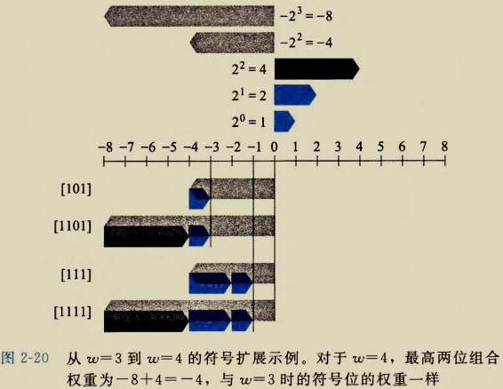{ width="800" }
&emsp;&emsp;有了这个直觉，我们现在可以展示保持补码值的符号扩展。  
&emsp;&emsp;推导：补码数值的符号扩展  
&emsp;&emsp;令 w'=w+k, 我们想要证明的是
 $$
\begin{split}
B2T_{w+k}([\underbrace{x_{w-1},\cdots,x_{w-1}},x_{w-1},x_{w-2},\cdots,x_0]) &= B2T_{w}([x_{w-1},x_{w-2},\cdots,x_{0}]) \newline
\end{split}
$$
&emsp;&emsp;下面的证明是对 K 进行归纳。也就是说，如果我们能够证明符号扩展一位保持了数值
不变，那么符号扩展任意位都能保持这种属性。因此，证明的任务就变为了：  
$$
\begin{split}
B2T_{w+1}([x_{w-1},x_{w-1},x_{w-2},\cdots,x_{0}]) &= B2T_{w}([x_{w-1},x_{w-2},\cdots,x_{0}]) \newline
\end{split}
$$
用等式(2. 3)展开左边的表达式，得到：  
$$
\begin{split}
B2T_{w+1}([x_{w-1},x_{w-1},x_{w-2},\cdots,x_{0}]) &= -x_{w-1}2^w + \sum_{i=0}^{w-1} x_i 2^i \newline
&= -x_{w-1}2^w + x_{w-1}2^{w-1} + \sum_{i=0}^{w-2} x_i 2^i \newline
&= -x_{w-1}(2^w - 2^{w-1}) + \sum_{i=0}^{w-2} x_i 2^i \newline
&= -x_{w-1}2^{w-1} + \sum_{i=0}^{w-2} x_i 2^i \newline
&= B2T_{w}([x_{w-1},x_{w-2},\cdots,x_{0}]) \newline
\end{split}
$$


我们使用的关键属性是 2^w^-2^w-1^ =2^w-1^ 。因此，加上一个权值为—2^w^ 的位，和将一个权值为
-2^w-1^ 的位转换为一个权值为 2^w-1^ 的位，这两项运算的综合效果就会保持原始的数值。
><font color=Blue>练习题 2. 22</font> 通过应用等式(2. 3), 表明下面每个位向量都是一5 的补码表示。  
&emsp;&emsp;A. [1011]  
&emsp;&emsp;B. [11011]  
&emsp;&emsp;C. [111011]  
&emsp;&emsp;可以看到第二个和第三个位向量可以通过对第一个位向量做符号扩展得到。  
&emsp;&emsp;值得一提的是，从一个数据大小到另一个数据大小的转换，以及无符号和有符号数字
之间的转换的相对顺序能够影响一个程序的行为。考虑下面的代码：  
```commandline
short sx = -12345; /* -12345 */
unsigned uy = sx; /* Mystery! */
printf("uy = %u:\t", uy);
show_bytes((byte_pointer) &uy, sizeof(unsigned));
```

>在一台大端法机器上，这部分代码产生如下输出：  
&emsp;&emsp;uy = 4294954951: ff ff cf c7  
&emsp;&emsp;这表明当把 short 转换成 unsigned 时，我们先要改变大小，之后再完成从有符号到
无符号的转换。也就是说 (unsigned) sx 等价于 (unsigned) (int) sx, 求值得到
4 294 954 951, 而不等价于 (unsigned) (unsigned short) sx, 后者求值得到 53 191。事
实上，这个规则是 C 语言标准要求的。  
---
><font color=Blue>练习题 2. 23</font> 考虑下面的 C 函数：  
```commandline
int fun1(unsigned word) {
    return (int) ((word«24)»24);
}
int fun2(unsigned word) {
    return ((int) word«24)»24;
}
```

>假设在一个采用补码运算的机器上以 32 位程序来执行这些函数。 还假设有符号数值
的右移是算术右移，而无符号数值的右移是逻辑右移。  
A. 填写下表，说明这些函数对几个示例参数的结果。你会发现用十六进制表示来做  
&emsp;&emsp;会更方便，只要记住十六进制数字 8 到 F 的最高有效位等于 1。
><table border=”1″ cellpadding=1>
    <tr>
        <td>w</td> 
        <td>funl(w)</td> 
        <td>fun2(w)</td> 
   </tr>
    <tr>
  		<td>0x00000076</td> 
        <td></td> 
        <td></td>
    </tr>
    <tr>
  		<td>0x87654321</td> 
        <td></td> 
        <td></td>
    </tr>
    <tr>
  		<td>0x000000C9</td> 
        <td></td> 
        <td></td>
    </tr>
    <tr>
  		<td>0xEDCBA987</td> 
        <td></td> 
        <td></td>
    </tr>
</table>
  
>B. 用语言来描述这些函数执行的有用的计算。  
## 2.2.7 截断数字  

&emsp;&emsp;假设我们不用额外的位来扩展一个数值，而是减少表示一个数字的位数。例如下面代
码中这种情况：
```c
int X = 53191;
short sx = (short) x; /*一12345 */
int y = sx; /*一12345 */
```

&emsp;&emsp;当我们把x强制类型转换为short时，我们就将 32 位的 int 截断为了 16 位的 short int
就像前面所看到的，这个 16 位的位模式就是一 12 345 的补码表示。当我们把它强制类型
转换回int时，符号扩展把高 16 位设置为 1, 从而生成一 12 345的32 位补码表示。  
&emsp;&emsp;当将一个w位的数$\vec{x}$= [x~w-1~, X~w-2~, …，x~0~]截断为一个 位数字时，我们会丢弃高
w-k 位，得到一个位向量 $\vec{x}$^‘^ = [x~k-1~, X~k-2~, …，x~0~]。截断一个数字可能会改变它的值一
溢出的一种形式。对千一个无符号数，我们可以很容易得出其数值结果。  
&emsp;&emsp;原理：截断无符号数  
&emsp;&emsp;令$\vec{x}$等于位向量[x~w-1~, X~w-2~, …，x~0~], 而$\vec{x}$^‘^是将其截断为 K 位的结果：$\vec{x}$^‘^ = [x~w-1~, X~w-2~, …，x~0~]
。令 x=B2U~w~($\vec{x}$), x^‘^=B2U~k~($\vec{x}$^‘^)。则 x'=x mod 2^k^。  
&emsp;&emsp;该原理背后的直觉就是所有被截去的位其权重形式都为 2^i^ 其中 i$\geq$k, 因此，每一个
权在取模操作下结果都为零。可用如下推导表示：  
&emsp;&emsp;推导：截断无符号数  
&emsp;&emsp;通过对等式 (2. 1) 应用取模运算就可以看到：  
&emsp;&emsp;&emsp;&emsp;B2U~w~([x~w-1~, x~w-2~,\cdots,x~0~])mod 2^k^ =   [$\sum\limits_{i=0}^{w-1}$x~i~2^i^]  mod 2^k^  
&emsp;&emsp;&emsp;&emsp;&emsp;&emsp;&emsp;&emsp;&emsp;&emsp;&emsp;&emsp;&emsp;&emsp;&emsp;&emsp;&emsp; = [$\sum\limits_{i=0}^{k-1}$x~i~2^i^]  mod 2^k^  
&emsp;&emsp;&emsp;&emsp;&emsp;&emsp;&emsp;&emsp;&emsp;&emsp;&emsp;&emsp;&emsp;&emsp;&emsp;&emsp;&emsp; = $\sum\limits_{i=0}^{k-1}$x~i~2^i^  
&emsp;&emsp;&emsp;&emsp;&emsp;&emsp;&emsp;&emsp;&emsp;&emsp;&emsp;&emsp;&emsp;&emsp;&emsp;&emsp;&emsp; = B2U~k~([x~k-1~, x~k-2~,\cdots,x~0~])  
在这段推导中，我们利用了属性：对于任何i$\geq$k, 2^i^ mod 2^k^ =0  
&emsp;&emsp;补码截断也具有相似的属性，只不过要将最高位转换为符号位：  
&emsp;&emsp;原理：截断补码数值  
令$\vec{x}$等于位向量[x~w-1~, X~w-2~, …，x~0~], 而$\vec{x}$^‘^是将其截断为 K 位的结果：$\vec{x}$^‘^ = [x~k-1~, X~k-2~, …，x~0~]。
令 x=BZU~w~($\vec{x}$), $\vec{x}$'=B2T~k~($\vec{x}$') 。则$\vec{x}$'=B2T~k~(x mod 2^k^)。  
&emsp;&emsp;  在这个公式中， x mod 2^k^ 将是0到 2^k^-1 之间的一个数。对其应用函数U2T~k~产生的
效果是把最高有效位 X~k-1~ 的权重从2^k-1^ 转变为-2^k-1^ 。举例来看，将数值 x=53191从
int 转换为 short 。由千 2^16^ = 65 536$\geq$x, 我们有 x mod 2^16^ =x 。但是，当我们把这个数
转换为 16 位的补码时，我们得到 x'=53 191—65 536= -12 345  
&emsp;&emsp;推导：截断补码数值  
&emsp;&emsp;使用与无符号数截断相同的参数，则有  
&emsp;&emsp;&emsp;&emsp;B2U~w~(x~w-1~, x~w-2~,\cdots,x~0~])mod 2^k^ = B2U~k~[x~k-1~, x~k-2~,\cdots,x~0~]  
也就是， x mod 2^k^能够被一个位级表示为 [x~k-1~, x~k-2~,\cdots,x~0~] 的无符号数表示。将其转
换为补码数则有 x'=U2T~k~ (x mod 2^k^)  
&emsp;&emsp;总而言之，无符号数的截断结果是：  
&emsp;&emsp;&emsp;&emsp;B2U~k~[x~k-1~, x~k-2~,\cdots,x~0~] = B2U~w~(x~w-1~, x~w-2~,\cdots,x~0~])mod 2^k^ &emsp;&emsp;(2. 9)  
而补码数字的截断结果是：  
&emsp;&emsp;&emsp;&emsp;B2T~k~[x~k-1~, x~k-2~,\cdots,x~0~] =U2T~k~(B2U~w~(x~w-1~, x~w-2~,\cdots,x~0~])) mod 2^k^ (2. 10)

><font color=Blue>练习题 2. 24</font> 假设将一个 位数值（用十六进制数字 O~F 表示）截断到一个 位数值
（用十六进制数字 0~7 表示）。填写下表，根据那些位模式的无符号和补码解释，说
明这种截断对某些情况的结果。  
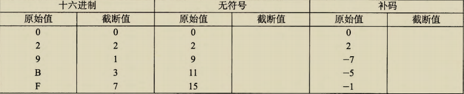{ width="800"}
&emsp;&emsp;解释如何将等式 (2. 9) 和等式 (2. 10) 应用到这些示例上。  

## 2.2.8 关千有符号数与无符号数的建议  

&emsp;&emsp;就像我们看到的那样，有符号数到无符号数的隐式强制类型转换导致了某些非直观的
行为。而这些非直观的特性经常导致程序错误，并且这种包含隐式强制类型转换的细微差
别的错误很难被发现。因为这种强制类型转换是在代码中没有明确指示的情况下发生的，
程序员经常忽视了它的影响。  
&emsp;&emsp;下面两个练习题说明了某些由于隐式强制类型转换和无符号数据类型造成的细微的错误。  
><font color=Blue>练习题 2. 25</font> 考虑下列代码，这段代码试图计算数组 中所有元素的和，其中元素的
数量由参数 length 给出。

```c
/* WARNING: This is buggy code */
float sum_elements(float a[], unsigned length) {
    int i;
    float result= O;
    for (i = O; i <= length-1; i++)
        result+= a[i];
    return result;
}
```
>&emsp;&emsp;当参数 length 等于 时，运行这段代码应该返回 0.0 。但实际上，运行时会遇
到一个内存错误。请解释为什么会发生这样的情况，并且说明如何修改代码。

---
><font color=Blue>练习题 26</font> 现在给你一个任务，写一个函数用来判定一个字符串是否比另一个更
长。前提是你要用字符串库函数 strlen, 它的声明如下：

```c
/* Prototype for library function strlen */
size_t strlen(const char *s);
    最开始你写的函数是这样的：
/* Determine whether strings is longer than string t */
/* WARNING: This function is buggy */
int strlonger(char *s, char *t) {
    return strlen(s) - strlen(t) > 0;
}
```
>&emsp;&emsp;当你在一些示例数据上测试这个函数时，一切似乎都是正确的。进一步研究发现
在头文件 dio.h 中数据类型 size_t 是定义成 unsigned int 的。  
A. 在什么情况下，这个函数会产生不正确的结果？ 
B. 解释为什么会出现这样不正确的结果。 
c.说明如何修改这段代码好让它能可靠地工作。    
---
> <font color=Blue>旁注</font> 函数 getpeername 的安全漏洞  
&emsp;&emsp;2002 年，从事 FreeBSD 开源操作系统项目的程序员意识到，他们对 getpeername
函数的实现存在安全漏洞 代码的简化版本如下：   

```C
    /*
     * Illustration of code vulnerability similar to that found in 
     * FreeBSD's implementation of getpeername () 
     */
     
     /* Declaration of library function memcpy */
     void *memcpy(void *dest, void *src, size_t n);
     
     /* Kernel memory region holding user-accessible data */
     #define KSIZE 1024
     char kbuf[KSIZE];
     
     /* Copy at most maxlen bytes from kernel region to user buffer */
     int copy_from_kernel(void *user_dest, int maxlen) {
        /* Byte count len is minimum of buffer size and maxlen */
        int len = KSIZE < maxlen ? KSIZE : maxlen;
        memcpy(user_dest, kbuf, len);
        return len;
     }
```

> &emsp;&emsp;在这段代码里，第 行给出的是库函数 memcpy 的原型，这个函数是要将一段指定
长度为 的宇节从内存的一个区域复制到另一个区域。  
&emsp;&emsp;从笫 14 行开始的函数 copy from_kernel 是要将一些操作系统内核维护的数据复
制到指定的用户可以访问的内存区域 对用户来说，大多数内核维护的数据结构应该是
不可读的，因为这些数据结构可能包含其他用户和系统上运行的其他作业的敏感信息，
但是显示为 kbuf 的区域是用户可以读的 参数 maxlen 给出的是分配给用户的缓冲区
的长度，这个缓冲区是用参数 user_dest 指示的 然后，第 16 行的计算确保复制的字
节数据不会超出源或者目标缓冲区可用的范围。  
&emsp;&emsp;不过，假设有些怀有恶意的程序员在调用 copy_from_kernel 的代码中对 maxlen
使用了负数值，那么，第 16 行的最小值计算会把这个值赋给 len, 然后 len 会作为参数n
被传递给 memcpy 不过，请注意参数 是被声明为数据类型 size_t 的。这个数据
类型是在库文件 stdio.h 中（通过 typedef) 被声明的 典型地，对 32 位程序它被定义为
unsigned 耳止，对 64 位程序定义为 unsigned long 既然参数 是无符号的，那么
memcpy 会把它当作一个非常大的正整数，并且试图将这样多宇节的数据从内核区域复
制到用户的缓冲区 虽然复制这么多字节 至少 实际上不会完成，因为程序会遇
到进程中非法地址的错误，但是程序还是能读到它没有被授权的内核内存区域。  
&emsp;&emsp;我们可以看到，这个问题是由于数据类型的不匹配造成的：在一个地方，长度参数
是有符号数；而另一个地方，它又是无符号数 正如这个例子表明的那样，这样的不匹
配会成为缺陷的原因，甚至会导致安全漏洞 幸运的是，还没有案例报告有程序员在
FreeBSD 上利用了这个漏洞 他们发布了一个安全建议， "FreeBSD-SA-02: 38. signederror", 建议系统管理员如何应用补丁消除这个漏洞 要修正这个缺陷，只要将 copy_
from_kernel 的参数 maxlen 声明为类型 size_t, 也就是与 memcpy 的参数 一致
时，我们也应该将本地变量 len 和返回值声明为 size_t。  

---    
&emsp;&emsp;我们已经看到了许多无符号运算的细微特性，尤其是有符号数到无符号数的隐式转
换，会导致错误或者漏洞的方式。避免这类错误的 种方法就是绝不使用无符号数。实际
上，除了 以外很少有语言支持无符号整数。很明显，这些语言的设计者认为它们带来的
麻烦要比益处多得多。比如， Java 只支持有符号整数，并且要求以补码运算来实现。正常
的右移运算符＞＞被定义为执行算术右移。特殊的运算符 ＞＞＞被指定为执行逻辑右移  
&emsp;&emsp;当我们想要把字仅仅看做是位的集合而没有任何数字意义时，无符号数值是非常有用的
例如，往一个字中放入描述各种布尔条件的标记 (flag) 时，就是这样。地址自然地就
是无符号的，所以系统程序员发现无符号类型是很有帮助的 。当 实现模运算和多精度运算
的数学包时，数字是由字的数组来表示的，无符号值也会非常有用。